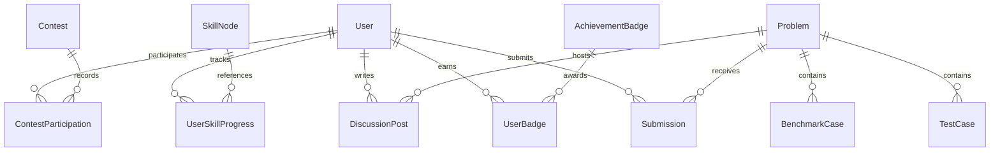
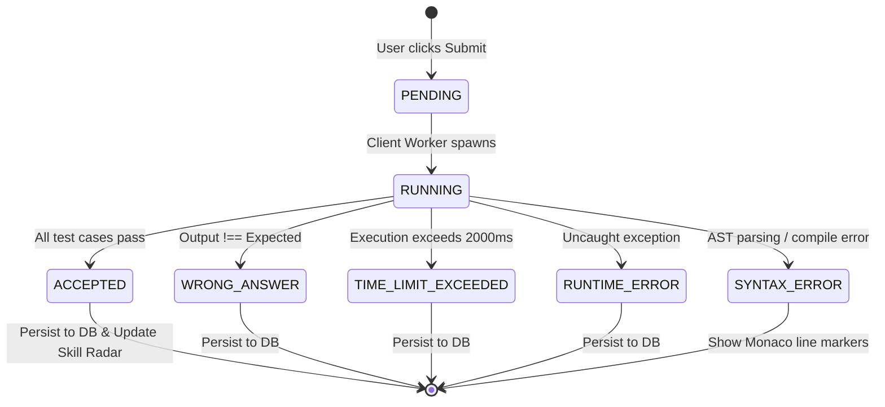

# Data Model: In-Browser Code Arena & Algorithm Platform

**Feature**: `001-in-browser-code-arena`  
**Database**: Neon Serverless PostgreSQL  
**ORM**: Drizzle ORM (`drizzle-orm/pg-core`)  
**Date**: 2026-09-16  

---

## 1. Entity-Relationship Overview

---

## 2. Table Definitions & Schemas

### 2.1 `users`
Represents an authenticated learner or competitive contestant.

| Column | Type | Constraints | Description |
|---|---|---|---|
| `id` | `text` / `uuid` | Primary Key, default `gen_random_uuid()` | Unique user identifier |
| `username` | `varchar(50)` | Unique, Not Null | Public display handle |
| `email` | `varchar(255)` | Unique, Not Null | User email address |
| `avatar_url` | `text` | Nullable | Profile photo URL |
| `rating` | `integer` | Not Null, default `1200` | Competitive contest rating (Glicko/Elo) |
| `streak_count` | `integer` | Not Null, default `0` | Consecutive days with $\ge 1$ accepted submission |
| `last_active_date`| `date` | Nullable | Date of last activity (for streak calculation) |
| `total_solved` | `integer` | Not Null, default `0` | Total distinct problems solved |
| `created_at` | `timestamp with time zone` | Not Null, default `now()` | Account creation timestamp |
| `updated_at` | `timestamp with time zone` | Not Null, default `now()` | Account update timestamp |

---

### 2.2 `problems`
Represents an algorithm or data structure challenge.

| Column | Type | Constraints | Description |
|---|---|---|---|
| `id` | `uuid` | Primary Key, default `gen_random_uuid()` | Unique problem identifier |
| `slug` | `varchar(100)` | Unique, Not Null | URL slug (e.g., `two-sum`, `valid-parentheses`) |
| `title` | `varchar(200)` | Not Null | Display title of the challenge |
| `description` | `text` | Not Null | Problem statement in Markdown formatting |
| `difficulty` | `varchar(20)` | Not Null, Enum (`EASY`, `MEDIUM`, `HARD`) | Problem difficulty tier |
| `topic_tags` | `text[]` / `jsonb` | Not Null | Category tags (e.g., `['Arrays', 'Hash Table']`) |
| `starter_code` | `text` | Not Null | Boilerplate code provided in the editor |
| `function_name`| `varchar(100)` | Not Null | Target function to invoke (e.g., `twoSum`) |
| `hints` | `jsonb` | Not Null, default `'[]'` | Array of progressive hint texts |
| `author_id` | `text` | Nullable, FK $\rightarrow$ `users.id` | Author/creator ID |
| `created_at` | `timestamp with time zone` | Not Null, default `now()` | Problem creation timestamp |

---

### 2.3 `test_cases`
Represents public and hidden validation test cases for a problem.

| Column | Type | Constraints | Description |
|---|---|---|---|
| `id` | `uuid` | Primary Key, default `gen_random_uuid()` | Unique test case ID |
| `problem_id` | `uuid` | Not Null, FK $\rightarrow$ `problems.id` ON DELETE CASCADE | Associated problem |
| `input` | `jsonb` | Not Null | Array of arguments passed to the function |
| `expected_output`| `jsonb` | Not Null | Expected return value |
| `is_public` | `boolean` | Not Null, default `false` | True if visible on the problem page |
| `order_index` | `integer` | Not Null, default `0` | Order of evaluation |
| `explanation` | `text` | Nullable | Optional explanation displayed on public failure |

---

### 2.4 `benchmark_cases`
Represents multi-size inputs for empirical Big-O complexity estimation.

| Column | Type | Constraints | Description |
|---|---|---|---|
| `id` | `uuid` | Primary Key, default `gen_random_uuid()` | Unique benchmark case ID |
| `problem_id` | `uuid` | Not Null, FK $\rightarrow$ `problems.id` ON DELETE CASCADE | Associated problem |
| `input_size` | `integer` | Not Null | Value of $N$ (e.g., 10, 100, 1000, 10000) |
| `input_payload` | `jsonb` | Not Null | Generated input arguments of size $N$ |

---

### 2.5 `submissions`
Records a user's code execution and grading history.

| Column | Type | Constraints | Description |
|---|---|---|---|
| `id` | `uuid` | Primary Key, default `gen_random_uuid()` | Unique submission ID |
| `user_id` | `text` | Not Null, FK $\rightarrow$ `users.id` | Submitting user ID |
| `problem_id` | `uuid` | Not Null, FK $\rightarrow$ `problems.id` | Solved problem ID |
| `code` | `text` | Not Null | Full JavaScript solution text |
| `status` | `varchar(30)` | Not Null | `ACCEPTED`, `WRONG_ANSWER`, `TIME_LIMIT_EXCEEDED`, `RUNTIME_ERROR`, `SYNTAX_ERROR` |
| `runtime_ms` | `numeric(8, 2)` | Nullable | Measured execution time (ms) |
| `memory_bytes` | `numeric(12, 2)`| Nullable | Estimated heap memory used |
| `passed_test_cases`| `integer` | Not Null, default `0` | Number of test cases passed |
| `total_test_cases` | `integer` | Not Null, default `0` | Total test cases executed |
| `test_results_detail`| `jsonb` | Nullable | Detailed verdict array per test case |
| `ast_metrics` | `jsonb` | Nullable | `{ loopDepth: 1, hasRecursion: false, estimatedBigO: "O(N)" }` |
| `submitted_at`| `timestamp with time zone` | Not Null, default `now()` | Submission timestamp |

---

### 2.6 `skill_nodes` & `user_skill_progress`
Represents the Directed Acyclic Graph (DAG) for curriculum progression and learner mastery.

#### `skill_nodes`
| Column | Type | Constraints | Description |
|---|---|---|---|
| `id` | `varchar(50)` | Primary Key | Node slug (e.g., `two_pointers`, `dp_1d`) |
| `topic_name` | `varchar(100)` | Not Null | Display name (e.g., "Two Pointers") |
| `description` | `text` | Not Null | Pedagogical summary |
| `icon` | `varchar(50)` | Not Null | Lucide icon identifier |
| `prerequisites`| `text[]` / `jsonb`| Not Null, default `'[]'` | Array of prerequisite `skill_nodes.id` |
| `required_solves`| `integer` | Not Null, default `3` | Minimum solved problems to unlock descendants |
| `order_index` | `integer` | Not Null, default `0` | Visual display ordering |

#### `user_skill_progress`
| Column | Type | Constraints | Description |
|---|---|---|---|
| `id` | `uuid` | Primary Key, default `gen_random_uuid()` | Unique record ID |
| `user_id` | `text` | Not Null, FK $\rightarrow$ `users.id` | Learner ID |
| `skill_node_id` | `varchar(50)` | Not Null, FK $\rightarrow$ `skill_nodes.id` | Topic ID |
| `solved_count` | `integer` | Not Null, default `0` | Solved problems in this topic |
| `mastery_score`| `numeric(5, 2)` | Not Null, default `0.0` | 0.00% to 100.00% mastery score |
| `is_unlocked` | `boolean` | Not Null, default `false` | Unlocked status based on prerequisites |
| `updated_at` | `timestamp with time zone` | Not Null, default `now()` | Last updated timestamp |

*Composite Unique Key: `(user_id, skill_node_id)`*

---

### 2.7 `contests` & `contest_participations`

#### `contests`
| Column | Type | Constraints | Description |
|---|---|---|---|
| `id` | `uuid` | Primary Key, default `gen_random_uuid()` | Unique contest ID |
| `slug` | `varchar(100)` | Unique, Not Null | URL slug (e.g., `weekly-arena-1`) |
| `title` | `varchar(200)` | Not Null | Contest display title |
| `description` | `text` | Not Null | Contest guidelines |
| `start_time` | `timestamp with time zone` | Not Null | Contest start time |
| `end_time` | `timestamp with time zone` | Not Null | Contest end time |
| `status` | `varchar(20)` | Not Null, Enum (`UPCOMING`, `ONGOING`, `FINISHED`) | Lifecycle state |
| `problem_weights`| `jsonb` | Not Null | Problem IDs mapped to point values (e.g., `{ "prob-1": 100, "prob-2": 250 }`) |

#### `contest_participations`
| Column | Type | Constraints | Description |
|---|---|---|---|
| `id` | `uuid` | Primary Key, default `gen_random_uuid()` | Participation record ID |
| `contest_id` | `uuid` | Not Null, FK $\rightarrow$ `contests.id` | Associated contest |
| `user_id` | `text` | Not Null, FK $\rightarrow$ `users.id` | Participant user ID |
| `score` | `integer` | Not Null, default `0` | Accumulated points |
| `penalty_minutes`| `integer` | Not Null, default `0` | Time penalties from rejected attempts |
| `final_rank` | `integer` | Nullable | Final placement on leaderboard |
| `rating_delta` | `integer` | Nullable | Rating change (+/- points) |

*Composite Unique Key: `(contest_id, user_id)`*

---

## 3. State Transitions

### Submission Lifecycle State Machine

---

## 4. Validation Rules

1. **Problem Slugs**: Lowercase alphanumeric with single hyphens (`^[a-z0-9]+(-[a-z0-9]+)*$`).
2. **Execution Bounds**:
   - Max code length: 65,536 characters.
   - Execution timeout: Hard cap at 2,000ms.
   - Max console output buffer: 10KB (prevent memory buffer flood from `console.log` spam).
3. **Contest Submission Eligibility**: Submissions for a contest are only accepted when `now() >= start_time` and `now() <= end_time`.
