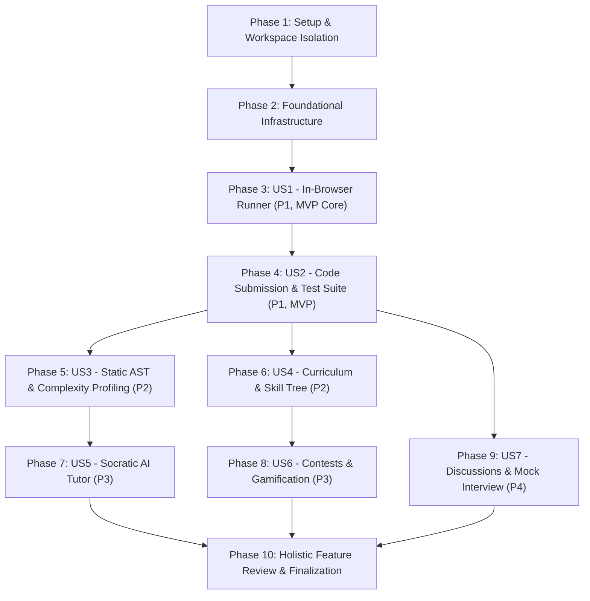

# Tasks: In-Browser Code Arena & Algorithm Learning Platform

**Feature**: `001-in-browser-code-arena`  
**Spec**: [spec.md](./spec.md) | **Plan**: [plan.md](./plan.md)  
**Date**: 2026-09-16  
**Status**: Ready for Implementation  

---

## Phase Architecture & Governance Standards

Every phase in this document strictly adheres to the **Dev Arena Constitution (v1.0.0)**:
1. **Dedicated Subagent Isolation**: Each phase MUST be launched and executed within its own dedicated subagent session to prevent context drift and memory contamination.
2. **Phase 1 Worktree Workspace Isolation**: Implementation begins in a dedicated git worktree (`dev-arena-worktree-001`).
3. **Mandatory Test-Driven Development (TDD)**: Every functional task adheres to Red $\rightarrow$ Green $\rightarrow$ Refactor (failing test verified before writing production code).
4. **Iterative Review & Bug Hunt Subagent Loop**: Every phase concludes with an autonomous review subagent auditing the phase diff; issues found are fixed iteratively until 0 bugs and 0 lint errors remain.
5. **Phase-End Conventional Commits**: Clean conventional commit executed immediately upon clearing the phase review gate.
6. **Holistic Feature-Level Review**: Final Phase 10 executes end-to-end integration across all phases before project finalization.

---

## Phase 1: Setup & Workspace Isolation

**Purpose**: Establish workspace isolation via git worktree, initialize the Next.js 16 + Bun full-stack project structure, install dependencies with verified latest versions, and configure developer tooling (TypeScript 7, ESLint, Tailwind CSS 4, Vitest, Playwright).

**Affected Files**:
- `package.json`
- `bunfig.toml`
- `tsconfig.json`
- `next.config.mjs`
- `drizzle.config.ts`
- `vitest.config.ts`
- `playwright.config.ts`
- `.env.example`
- `.gitignore`

**Validation Commands**:
- `bun install` (Clean zero-error dependency installation)
- `bun run typecheck` (`tsc --noEmit` exits with code 0)
- `bun test` (Test runner boots and executes with 0 failures)

### Phase 1 Workflow & Checklist

- [X] T001 Prompt user to confirm creation of isolated git worktree `dev-arena-001-sandbox` and switch workspace to it
- [X] T002 Launch dedicated Phase 1 subagent for project scaffolding
- [X] T003 Initialize Next.js 16 App Router project with Bun in package.json using exact verified latest packages (`next@^16.3.5`, `react@^19.3.0`, `react-dom@^19.3.0`, `typescript@^7.0.2`, `tailwindcss@^4.3.3`, `bun@^1.4.2`)
- [X] T004 [P] Configure TypeScript 7 compiler options in tsconfig.json with strict type checking, path aliases (`@/*` -> `./src/*`), and DOM/WebWorker lib types
- [X] T005 [P] Configure Drizzle ORM and Neon connection settings in drizzle.config.ts
- [X] T006 [P] Configure Vitest unit test runner in vitest.config.ts and Playwright in playwright.config.ts
- [X] T007 [P] Create .env.example with `DATABASE_URL` placeholder for Neon Serverless PostgreSQL
- [X] T008 Run validation commands (`bun install`, `bun test`, `bun run typecheck`) and verify zero errors
- [X] T009 Spawn review subagent to audit Phase 1 scaffolding, hunt for configuration bugs, and verify compliance with constitution
- [X] T010 Execute Phase 1 conventional commit: `chore(setup): scaffold Next.js 16, Bun, Drizzle, and test tooling`

---

## Phase 2: Foundational Infrastructure

**Purpose**: Implement shared core infrastructure: Neon Serverless PostgreSQL Drizzle client, complete database schema, migration push script, curated problem seed data, and root application navigation shell.

**Affected Files**:
- `src/lib/db/client.ts`
- `src/lib/db/schema.ts`
- `src/lib/db/seeds/seed-problems.ts`
- `src/types/db.ts`
- `src/app/layout.tsx`
- `src/app/page.tsx`
- `tests/unit/db-client.test.ts`

**Validation Commands**:
- `bun test tests/unit/db-client.test.ts` (Validates Drizzle client initialization and schema inference)
- `bun run db:push` (Pushes Drizzle schema to Neon DB)
- `bun run db:seed` (Inserts initial DSA problems and Skill Nodes)

### Phase 2 Workflow & Checklist

- [X] T011 Launch dedicated Phase 2 subagent for database & foundation infrastructure
- [X] T012 [P] Author unit test verifying database schema definitions and types in tests/unit/db-client.test.ts (TDD Red)
- [X] T013 Implement Drizzle PostgreSQL table schemas in src/lib/db/schema.ts (`users`, `problems`, `test_cases`, `benchmark_cases`, `submissions`, `skill_nodes`, `user_skill_progress`, `contests`, `contest_participations`, `achievement_badges`, `discussion_posts`)
- [X] T014 Implement singleton Drizzle client with Neon stateless HTTP driver in src/lib/db/client.ts
- [X] T015 [P] Export TypeScript schema types and validation schemas in src/types/db.ts
- [X] T016 Implement seed script in src/lib/db/seeds/seed-problems.ts providing foundational problems (Two Sum, Valid Parentheses, Reverse Linked List) and core Skill Nodes
- [X] T017 Implement root layout with dark theme, responsive navigation bar, and footer in src/app/layout.tsx
- [X] T018 Implement landing hero page showcasing interactive features and algorithm tracks in src/app/page.tsx
- [X] T019 Run tests to verify green state (`bun test tests/unit/db-client.test.ts`)
- [X] T020 Spawn review subagent to audit schema consistency against data-model.md, test edge cases, and ensure zero lint errors
- [X] T021 Execute Phase 2 conventional commit: `feat(db): implement Neon PostgreSQL schema, Drizzle client, and seed dataset`

---

## Phase 3: User Story 1 - In-Browser Problem Solving & Instant Execution (Priority: P1) [MVP Core]

**Goal**: Deliver a 100% in-browser, sub-200ms JavaScript execution sandbox in an isolated Web Worker, featuring instant test running against public test cases, infinite loop safety cutoff (TLE 2000ms), console logging interception, and deep-equality validation with Monaco Editor.

**Independent Test**: Navigate to `/problems/two-sum`, write solution, click "Run Code", see individual public test case verdicts (Pass/Fail) in $<200\text{ ms}$, with infinite loop `while(true){}` terminating cleanly at 2000ms.

**Affected Files**:
- `src/lib/runner/deep-equal.ts`
- `src/lib/runner/runner.worker.ts`
- `src/lib/runner/WorkerRunnerManager.ts`
- `src/components/editor/MonacoCodeEditor.tsx`
- `src/components/editor/EditorHeader.tsx`
- `src/components/editor/OutputPanel.tsx`
- `src/app/problems/[slug]/page.tsx`
- `src/app/api/problems/[slug]/route.ts`
- `tests/unit/deep-equal.test.ts`
- `tests/unit/runner-manager.test.ts`
- `tests/contract/problems-api.test.ts`

**Validation Commands**:
- `bun test tests/unit/deep-equal.test.ts`
- `bun test tests/unit/runner-manager.test.ts`
- `bun test tests/contract/problems-api.test.ts`

### Phase 3 Workflow & Checklist

- [X] T022 Launch dedicated Phase 3 subagent for User Story 1
- [X] T023 [P] [US1] Author unit test for deep equality comparison in tests/unit/deep-equal.test.ts (TDD Red: handles primitives, nested objects, arrays, null/undefined, and cyclic references)
- [X] T024 [P] [US1] Author unit test for WorkerRunnerManager in tests/unit/runner-manager.test.ts (TDD Red: test execution success, output capture, and 2000ms TLE abort)
- [X] T025 [P] [US1] Author contract test for GET /api/problems/[slug] in tests/contract/problems-api.test.ts (TDD Red)
- [X] T026 [P] [US1] Implement robust structural deep-equal comparator in src/lib/runner/deep-equal.ts
- [X] T027 [US1] Implement isolated sandboxed Web Worker in src/lib/runner/runner.worker.ts with proxy console logging and exception boundary
- [X] T028 [US1] Implement WorkerRunnerManager in src/lib/runner/WorkerRunnerManager.ts managing worker lifecycle, timeout timers (2000ms), and worker.terminate() safety cutoff
- [X] T029 [US1] Implement route handler for problem detail in src/app/api/problems/[slug]/route.ts
- [X] T030 [P] [US1] Implement Monaco Code Editor component in src/components/editor/MonacoCodeEditor.tsx with JavaScript language mode, dark theme, and code folding
- [X] T031 [P] [US1] Implement EditorHeader component in src/components/editor/EditorHeader.tsx with Run / Submit triggers and reset button
- [X] T032 [P] [US1] Implement OutputPanel component in src/components/editor/OutputPanel.tsx rendering tabs for test cases, console output logs, and execution duration
- [X] T033 [US1] Assemble complete problem workspace in src/app/problems/[slug]/page.tsx connecting editor, worker runner, and output panel
- [X] T034 Verify all tests pass (`bun test tests/unit/deep-equal.test.ts tests/unit/runner-manager.test.ts tests/contract/problems-api.test.ts`)
- [X] T035 Spawn review subagent to audit in-browser execution safety, memory leaks in worker lifecycle, and UI responsiveness
- [X] T036 Execute Phase 3 conventional commit: `feat(runner): implement in-browser Web Worker execution engine and Monaco workspace`

---

## Phase 4: User Story 2 - Code Submission & Test Suite Verification (Priority: P1) [Complete MVP]

**Goal**: Enable users to submit solutions against the complete test suite (including hidden edge cases, boundary conditions, and performance tests), clean and sanitize error stack traces, persist submissions to Neon PostgreSQL, and update problem completion state.

**Independent Test**: Click "Submit" on a problem; code runs through hidden test suite, displays a submission verdict modal (Accepted / Wrong Answer / Runtime Error), records the entry into `submissions` table, and marks the problem as solved.

**Affected Files**:
- `src/lib/runner/error-sanitizer.ts`
- `src/app/api/problems/[slug]/test-cases/route.ts`
- `src/app/api/submissions/route.ts`
- `src/app/api/submissions/[id]/route.ts`
- `src/components/editor/SubmissionModal.tsx`
- `tests/unit/error-sanitizer.test.ts`
- `tests/contract/submissions-api.test.ts`

**Validation Commands**:
- `bun test tests/unit/error-sanitizer.test.ts`
- `bun test tests/contract/submissions-api.test.ts`

### Phase 4 Workflow & Checklist

- [X] T037 Launch dedicated Phase 4 subagent for User Story 2
- [X] T038 [P] [US2] Author unit tests for error stack trace sanitizer in tests/unit/error-sanitizer.test.ts (TDD Red: strips internal worker wrappers and maps to user code line/column)
- [X] T039 [P] [US2] Author contract tests for POST /api/submissions and GET /api/submissions in tests/contract/submissions-api.test.ts (TDD Red)
- [X] T040 [US2] Implement stack trace sanitizer in src/lib/runner/error-sanitizer.ts
- [X] T041 [US2] Implement test case loader endpoint in src/app/api/problems/[slug]/test-cases/route.ts supporting public and hidden evaluation scopes
- [X] T042 [US2] Implement submission creation and history endpoint in src/app/api/submissions/route.ts with Drizzle insert and status calculation
- [X] T043 [US2] Implement submission detail query in src/app/api/submissions/[id]/route.ts
- [X] T044 [P] [US2] Implement SubmissionModal component in src/components/editor/SubmissionModal.tsx rendering Accepted badges, runtime percentiles, and test breakdown
- [X] T045 [US2] Integrate Submit workflow in src/app/problems/[slug]/page.tsx triggering test-suite evaluation and submission persistence
- [X] T046 Verify all tests pass (`bun test tests/unit/error-sanitizer.test.ts tests/contract/submissions-api.test.ts`)
- [X] T047 Spawn review subagent to audit submission security, hidden test case confidentiality, and error sanitization
- [X] T048 Execute Phase 4 conventional commit: `feat(submission): implement comprehensive test evaluation and submission persistence`

---

## Phase 5: User Story 3 - Code Quality, Static AST & Complexity Analysis (Priority: P2)

**Goal**: Analyze user code directly in the browser using `@babel/parser` for loop depth, recursion detection, and syntax error markers in Monaco Editor, paired with empirical multi-$N$ benchmark profiling to estimate Big-O time and space complexity.

**Independent Test**: Write an $O(N^2)$ nested loop; see Monaco editor annotate line warnings and the Analysis card display "Estimated Complexity: $O(N^2)$ (Optimal: $O(N)$)".

**Affected Files**:
- `src/lib/analysis/ast-analyzer.ts`
- `src/lib/analysis/complexity-profiler.ts`
- `src/components/editor/monaco-markers.ts`
- `src/components/analysis/ComplexityCard.tsx`
- `src/components/analysis/AstWarningsList.tsx`
- `tests/unit/ast-analyzer.test.ts`
- `tests/unit/complexity-profiler.test.ts`

**Validation Commands**:
- `bun test tests/unit/ast-analyzer.test.ts`
- `bun test tests/unit/complexity-profiler.test.ts`

### Phase 5 Workflow & Checklist

- [X] T049 Launch dedicated Phase 5 subagent for User Story 3
- [X] T050 [P] [US3] Author unit tests for AST loop depth and recursion scanner in tests/unit/ast-analyzer.test.ts (TDD Red)
- [X] T051 [P] [US3] Author unit tests for empirical multi-N curve fitting in tests/unit/complexity-profiler.test.ts (TDD Red: tests linear vs quadratic growth ratios)
- [X] T052 [US3] Implement AST analysis engine in src/lib/analysis/ast-analyzer.ts using @babel/parser and @babel/traverse
- [X] T053 [US3] Implement empirical benchmark profiler in src/lib/analysis/complexity-profiler.ts running inputs of $N=10, 100, 1000, 10000$
- [X] T054 [P] [US3] Implement Monaco marker synchronizer in src/components/editor/monaco-markers.ts translating AST syntax errors and warnings to editor underlines
- [X] T055 [P] [US3] Implement ComplexityCard component in src/components/analysis/ComplexityCard.tsx with empirical runtime chart
- [X] T056 [P] [US3] Implement AstWarningsList component in src/components/analysis/AstWarningsList.tsx showing code quality tips
- [X] T057 [US3] Integrate analysis panel into problem workspace in src/app/problems/[slug]/page.tsx
- [X] T058 Verify all tests pass (`bun test tests/unit/ast-analyzer.test.ts tests/unit/complexity-profiler.test.ts`)
- [X] T059 Spawn review subagent to audit AST parser performance on large inputs and accuracy of curve fitting heuristics
- [X] T060 Execute Phase 5 conventional commit: `feat(analysis): implement static AST inspection and empirical Big-O profiler`

---

## Phase 6: User Story 4 - Structured Curriculum, Skill Tree & Progress Tracking (Priority: P2)

**Goal**: Deliver a visual, interactive Directed Acyclic Graph (DAG) Skill Tree with prerequisite unlock conditions, a tagged Problem Library with difficulty/topic filtering, and a personalized Skill Radar Chart.

**Independent Test**: Complete foundational array problems; observe dependent "Two Pointers" node unlock automatically, and view mastery score increase on the Skill Radar chart.

**Affected Files**:
- `src/lib/curriculum/skill-graph.ts`
- `src/app/api/skills/tree/route.ts`
- `src/app/api/skills/radar/route.ts`
- `src/components/curriculum/SkillTreeGraph.tsx`
- `src/components/curriculum/SkillRadarChart.tsx`
- `src/app/skills/page.tsx`
- `src/app/problems/page.tsx`
- `tests/unit/skill-graph.test.ts`
- `tests/contract/skills-api.test.ts`

**Validation Commands**:
- `bun test tests/unit/skill-graph.test.ts`
- `bun test tests/contract/skills-api.test.ts`

### Phase 6 Workflow & Checklist

- [ ] T061 Launch dedicated Phase 6 subagent for User Story 4
- [ ] T062 [P] [US4] Author unit tests for Skill Tree DAG traversal and prerequisite unlocking in tests/unit/skill-graph.test.ts (TDD Red)
- [ ] T063 [P] [US4] Author contract tests for GET /api/skills/tree and GET /api/skills/radar in tests/contract/skills-api.test.ts (TDD Red)
- [ ] T064 [US4] Implement skill graph DAG evaluation logic in src/lib/curriculum/skill-graph.ts
- [ ] T065 [US4] Implement Skill Tree endpoint in src/app/api/skills/tree/route.ts returning node unlock states for user
- [ ] T066 [US4] Implement Skill Radar endpoint in src/app/api/skills/radar/route.ts aggregating topic mastery percentages
- [ ] T067 [P] [US4] Implement interactive DAG visualization component in src/components/curriculum/SkillTreeGraph.tsx with node connections and status badges
- [ ] T068 [P] [US4] Implement SkillRadarChart component in src/components/curriculum/SkillRadarChart.tsx using SVG/Canvas
- [ ] T069 [US4] Implement Curriculum Roadmap page in src/app/skills/page.tsx hosting the Skill Tree and Radar view
- [ ] T070 [US4] Implement Problem Library catalog page in src/app/problems/page.tsx with topic, difficulty, and solved status filters
- [ ] T071 Verify all tests pass (`bun test tests/unit/skill-graph.test.ts tests/contract/skills-api.test.ts`)
- [ ] T072 Spawn review subagent to audit DAG cycle prevention, unlock state transitions, and responsive layout
- [ ] T073 Execute Phase 6 conventional commit: `feat(curriculum): implement DAG skill tree, problem library, and mastery radar chart`

---

## Phase 7: User Story 5 - Socratic AI Tutor Assistance (Priority: P3)

**Goal**: Provide an in-workspace AI Tutor delivering 3-tier progressive hints (Level 1: Conceptual/Edge case $\rightarrow$ Level 2: Algorithmic pattern $\rightarrow$ Level 3: Pseudocode flow) with strict regex guardrails forbidding direct code spoilers.

**Independent Test**: Request a hint while solving a problem; receive a diagnostic question without any copy-pasteable solution code.

**Affected Files**:
- `src/lib/ai/socratic-tutor.ts`
- `src/app/api/ai/hint/route.ts`
- `src/components/ai/AITutorPanel.tsx`
- `tests/unit/socratic-tutor.test.ts`
- `tests/contract/ai-hint-api.test.ts`

**Validation Commands**:
- `bun test tests/unit/socratic-tutor.test.ts`
- `bun test tests/contract/ai-hint-api.test.ts`

### Phase 7 Workflow & Checklist

- [ ] T074 Launch dedicated Phase 7 subagent for User Story 5
- [ ] T075 [P] [US5] Author unit tests for Socratic prompt builder and anti-spoiler regex guardrails in tests/unit/socratic-tutor.test.ts (TDD Red: rejects code blocks or solution reveals)
- [ ] T076 [P] [US5] Author contract test for POST /api/ai/hint in tests/contract/ai-hint-api.test.ts (TDD Red)
- [ ] T077 [US5] Implement Socratic hint prompt engineering and anti-solution output filter in src/lib/ai/socratic-tutor.ts
- [ ] T078 [US5] Implement AI hint API route in src/app/api/ai/hint/route.ts with rate-limiting and tier validation
- [ ] T079 [P] [US5] Implement AITutorPanel drawer component in src/components/ai/AITutorPanel.tsx inside the problem workspace
- [ ] T080 [US5] Integrate AI Tutor drawer into problem page in src/app/problems/[slug]/page.tsx
- [ ] T081 Verify all tests pass (`bun test tests/unit/socratic-tutor.test.ts tests/contract/ai-hint-api.test.ts`)
- [ ] T082 Spawn review subagent to audit prompt injection resistance, anti-spoiler regex robustness, and API latency
- [ ] T083 Execute Phase 7 conventional commit: `feat(ai): implement tiered Socratic AI tutor with anti-spoiler guardrails`

---

## Phase 8: User Story 6 - Timed Contests, Rating & Gamification (Priority: P3)

**Goal**: Support scheduled timed coding contests, ICPC-style scoring with penalty minutes, post-contest rating recalculation (Glicko-2), public leaderboards, and user achievement badges.

**Independent Test**: Submit during an active contest; score and penalty update in real-time on the contest leaderboard, and contest conclusion recalculates user rating.

**Affected Files**:
- `src/lib/contests/rating-engine.ts`
- `src/app/api/contests/route.ts`
- `src/app/api/contests/[slug]/leaderboard/route.ts`
- `src/app/contests/page.tsx`
- `src/app/contests/[slug]/page.tsx`
- `src/app/profile/[username]/page.tsx`
- `src/components/profile/BadgeList.tsx`
- `tests/unit/rating-engine.test.ts`
- `tests/contract/contests-api.test.ts`

**Validation Commands**:
- `bun test tests/unit/rating-engine.test.ts`
- `bun test tests/contract/contests-api.test.ts`

### Phase 8 Workflow & Checklist

- [ ] T084 Launch dedicated Phase 8 subagent for User Story 6
- [ ] T085 [P] [US6] Author unit tests for rating adjustment algorithm and penalty scoring in tests/unit/rating-engine.test.ts (TDD Red)
- [ ] T086 [P] [US6] Author contract tests for contest listing and leaderboard API in tests/contract/contests-api.test.ts (TDD Red)
- [ ] T087 [US6] Implement rating calculation and scoring logic in src/lib/contests/rating-engine.ts
- [ ] T088 [US6] Implement contest endpoints in src/app/api/contests/route.ts and src/app/api/contests/[slug]/leaderboard/route.ts
- [ ] T089 [P] [US6] Implement Contests list page in src/app/contests/page.tsx showing upcoming, ongoing, and past contests
- [ ] T090 [US6] Implement live contest arena page with timer and leaderboard in src/app/contests/[slug]/page.tsx
- [ ] T091 [P] [US6] Implement user public profile and rating history chart in src/app/profile/[username]/page.tsx
- [ ] T092 [P] [US6] Implement BadgeList component in src/components/profile/BadgeList.tsx displaying streak and contest achievement badges
- [ ] T093 Verify all tests pass (`bun test tests/unit/rating-engine.test.ts tests/contract/contests-api.test.ts`)
- [ ] T094 Spawn review subagent to audit contest timer synchronization, penalty calculations, and leaderboard query performance
- [ ] T095 Execute Phase 8 conventional commit: `feat(contest): implement timed contest arena, rating engine, and achievement badges`

---

## Phase 9: User Story 7 - Community Discussions & Mock Interview (Priority: P4)

**Goal**: Provide problem solution discussions categorized by Big-O approaches with community voting, and peer mock interview rooms with collaborative editor synchronization.

**Independent Test**: Post a solution write-up with Markdown in a problem discussion tab; upvote it, and open a mock interview room with a live countdown timer.

**Affected Files**:
- `src/app/api/problems/[slug]/discussions/route.ts`
- `src/components/discussions/ProblemDiscussions.tsx`
- `src/app/interview/page.tsx`
- `src/app/interview/[roomId]/page.tsx`
- `tests/contract/discussions-api.test.ts`

**Validation Commands**:
- `bun test tests/contract/discussions-api.test.ts`

### Phase 9 Workflow & Checklist

- [ ] T096 Launch dedicated Phase 9 subagent for User Story 7
- [ ] T097 [P] [US7] Author contract tests for discussions endpoints in tests/contract/discussions-api.test.ts (TDD Red)
- [ ] T098 [US7] Implement discussions API route in src/app/api/problems/[slug]/discussions/route.ts
- [ ] T099 [P] [US7] Implement ProblemDiscussions component in src/components/discussions/ProblemDiscussions.tsx with Markdown rendering and approach tags
- [ ] T100 [US7] Implement Mock Interview lobby in src/app/interview/page.tsx
- [ ] T101 [US7] Implement collaborative Mock Interview room in src/app/interview/[roomId]/page.tsx with shared problem description and timer
- [ ] T102 Verify all tests pass (`bun test tests/contract/discussions-api.test.ts`)
- [ ] T103 Spawn review subagent to audit discussion content sanitization (XSS prevention) and room lifecycle
- [ ] T104 Execute Phase 9 conventional commit: `feat(community): implement solution discussions and mock interview room`

---

## Phase 10: Holistic Feature Review & Finalization

**Purpose**: Execute end-to-end integration testing, full browser journey validation with Playwright, final security audit, typecheck, linting, and project documentation finalization.

**Affected Files**:
- `tests/e2e/solve-problem.spec.ts`
- `tests/e2e/contests.spec.ts`
- `README.md`

**Validation Commands**:
- `bun run typecheck` (`tsc --noEmit` must pass with 0 errors)
- `bun run lint` (ESLint must pass with 0 warnings/errors)
- `bun test` (All unit and contract tests must pass 100%)
- `bun run test:e2e` (Playwright tests must pass end-to-end)

### Phase 10 Workflow & Checklist

- [ ] T105 Launch dedicated Phase 10 subagent for holistic feature review
- [ ] T106 Implement Playwright E2E test verifying complete problem solving journey in tests/e2e/solve-problem.spec.ts (navigate -> solve Two Sum -> Run Code -> Submit -> check solved badge)
- [ ] T107 [P] Implement Playwright E2E test for contest navigation and leaderboards in tests/e2e/contests.spec.ts
- [ ] T108 Execute full validation suite (`bun run typecheck`, `bun run lint`, `bun test`, `bun run test:e2e`)
- [ ] T109 Spawn final review subagent to perform aggressive bug hunting, audit edge cases, and ensure strict compliance with constitution
- [ ] T110 Update project README.md with architecture overview, local development guide with Bun, and screenshots/GIFs
- [ ] T111 Execute final comprehensive conventional commit: `chore(release): finalize Dev Arena in-browser code arena v1.0.0`

---

## Dependencies & Execution Order

### Critical Path to MVP
1. **Phase 1** (Setup & Worktree) $\rightarrow$ **Phase 2** (Database & Foundation) $\rightarrow$ **Phase 3** (US1 In-Browser Runner) $\rightarrow$ **Phase 4** (US2 Submission Engine).
2. Upon completing Phase 4, the platform delivers a complete, production-ready MVP where learners can solve and submit JavaScript algorithm problems with instant in-browser execution and database tracking.

---

## Task Summary Metrics

- **Total Tasks**: 111 tasks across 10 structured phases
- **Phase Breakdown**:
  - Phase 1 (Setup): 10 tasks
  - Phase 2 (Foundation): 11 tasks
  - Phase 3 (US1 In-Browser Runner - MVP Core): 15 tasks
  - Phase 4 (US2 Submission Engine - Complete MVP): 12 tasks
  - Phase 5 (US3 AST & Complexity): 12 tasks
  - Phase 6 (US4 Skill Tree & Roadmap): 13 tasks
  - Phase 7 (US5 Socratic AI Tutor): 10 tasks
  - Phase 8 (US6 Contests & Gamification): 12 tasks
  - Phase 9 (US7 Discussions & Mock Interview): 9 tasks
  - Phase 10 (Holistic Review & Finalization): 7 tasks
- **Checklist Compliance**: 100% of tasks format strictly with `- [ ] [TID] [P?] [US?] Description with exact file path`
- **Quality Gates**: Every phase includes explicit dedicated subagent launch, TDD test authoring, iterative review subagent loop, and conventional commit gates.
